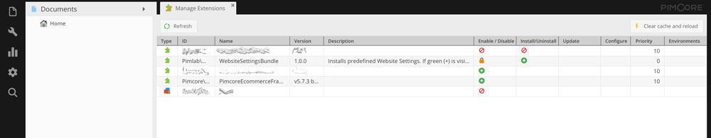
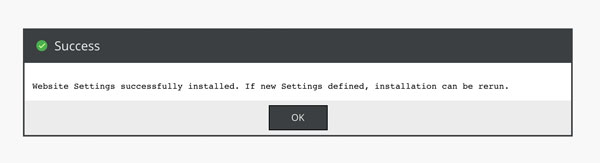
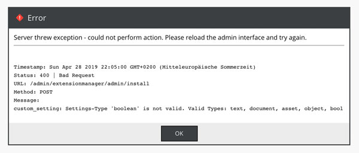
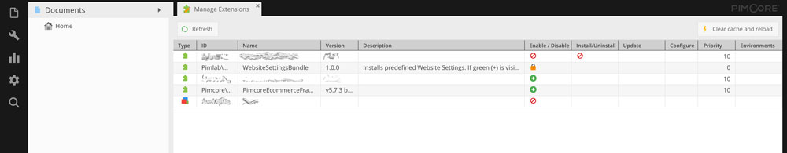

# Pimcore Website Settings Bundle

Website Settings installer for Pimcore 5 and Pimcore 6

Often Pimcore Website-Settings are defined but has different value, depending on the system instance is running on and settings type.
Additionally if you set up a new (development) environment the settings has set again because you can't add the data filled settings to
your VCS. Is there more than one setting you have to add, it will be a very stupid work it you do it more than one time.

With Pimcore Website Settings Bundle you can define settings you need in every environment an can add them with only one click.
If you add some new settings later, you can add them in all environments with same click.  

## Requirements

- Pimcore >= 5.4.0
- Pimcore >= 6.0.0

## Installation

`````bash
$ composer require pimlab/website-settings
`````

## Usage

There is a simple way to use the bundle and define them in your project.

### Add Website Settings Bundle configuration

Add configuration to your ``/app/config/config.yml`` file or put them in different YAML files and include them to the globe config.

**Basic Config**
````yaml
website_settings:
    settings:
        my_custom_setting_key:
            type: 'text'
            data: 'This is a text value'
        another_custom_setting_key:
            type: 'bool'
            data: true
````

### Install Website Settings from definition

Login into the Backend of your Pimcore instance you had defined the Settings in. Open the ``Manage Extentions`` view by clicking ``Tools -> Extensions`` in the sidebar.

You will find an Extension called ``WebsiteSettingsBundle``. If you will see a green `(+)` on `Install/Uninstall` column if they are any setting defined but not added to the system.



On a click all defined Settings will be installed.

#### Install Success



#### Install Failed



#### Nothing to install yet



## Configuration Options

| Setting   | Default | Required | Description                                                                           |
|-----------|---------|----------|---------------------------------------------------------------------------------------|
| type      |         | yes      | Valid Types: text, document, asset, object, bool                                      |
| data      |         | no       | If you want to preset data, you can do it here. Mostly useful for text and bool type. |
| multilang | false   | no       | If true, the setting will add for every language defined in Pimcore                   |
| multisite | false   | no       | If true, the setting will add for every site defined in Pimcore                       |

## Advanced Usage

If you have a multi site and/or multi lingual page, you can add a setting for every lang and/or site instance to your system.  
**NOTICE:** If you set multilang and multisite to ``true`` on one setting, the setting will be add multiplied by site and lang! 

**Advanced Config**
````yaml
website_settings:
    settings:
        my_custom_setting_key:
            type: 'text'
            data: 'This is a text value'
        another_custom_setting_key:
            type: 'bool'
            data: true
        third_custom_setting_key:
            type: 'document'
            multilang: true
            multisite: true
````

## Copyright and license
GPLv3 - Visit [License](LICENSE.md)  
Copyright: [PimLab](https://pimlab.de)
